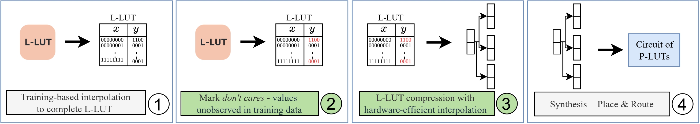

# ReducedLUT <a href="https://doi.org/10.5281/zenodo.14499541"></a>
Lookup tables (LUTs) are frequently used to efficiently store arrays of precomputed values for complex mathematical computations. When used in the context of neural networks, these functions exhibit a lack of recognizable patterns which presents an unusual challenge for conventional logic synthesis techniques. ReducedLUT is a tool for compression of lookup tables and generation of their hardware files in Verilog for RTL designs, as we demonstrated across multiple machine learning applications where don't care conditions can be leveraged for greater compresion. This project is a derivative work based on [CompressedLUT](https://github.com/kiabuzz/CompressedLUT).

This code is part of a paper accepted to the ACM/SIGDA International Symposium on Field-Programmable Gate Arrays 2025, which is available [here](https://arxiv.org/abs/2412.18579).

## Installation
```bash
git clone https://github.com/ollycassidy13/ReducedLUT.git
cd ReducedLUT
make
```
    
## Getting Started
#### Lookup Table as a Text File
A text (.txt) file, containing the values of your lookup table, should be prepared as an input. The file must contain a power of 2 lines, each of which is a single hexadecimal value in ascending input order. An example of such a text file can be found in `table.txt`. The following command generates hardware files corresponding to the lookup table described in that text file.

```bash
./reducedlut -table table.txt
```

#### Introducing *Don't Cares*
A text (.txt) file, containing the values of your lookup table, should be prepared as before. Another text file containing the input data should be prepared too, containing the data to be used to determine *don't cares*. This should be arranged as binary values each on a seperate line with a bitwidth equal to the table's input bitwidth. A rarity and exiguity threshold should also be specified (for more information on these parameters see the `help.txt` file).

```bash
./reducedlut -table table.txt -input input.txt -exiguity 4 -rarity 1
```

See the `help.txt` file for command line arguments in more detail.

## ReducedLUT Flow

This section describes how to evaluate LUT based neural networks using the ReducedLUT methodology. The process described in the publication is based on [NeuraLUT](https://github.com/MartaAndronic/NeuraLUT), where trained models are mapped to a series of L-LUTs. To get started:

1. **Train and Map**  
   First, train a NeuraLUT model following the instructions provided in the [NeuraLUT repository](https://github.com/MartaAndronic/NeuraLUT). The trained model should then be mapped into L-LUTs, one for each neuron.

2. **Inference and Logging**  
   After the L-LUTs are obtained, run an inference pass on your training dataset. During this step, log each neuron's input in text files. 

3. **Run ReducedLUT**  
   Use the logged neuron inputs (text files) as well as each neuron's corresponding L-LUT to run the ReducedLUT script. Each neuron should be processed independently. ReducedLUT will evaluate the L-LUT and input data and provide the compressed L-LUT as a Verilog file.

Below is a diagram illustrating the flow:



## Summary of Major Modifications
- The novelty of our work is through the integration of *don't cares* within the heart of the LUT decomposition to enhance its capabilities
- ReducedLUT is specifically optimised to implement *don't cares* within machine learning applications
- ReducedLUT takes 3 new inputs - a inputs file, rarity threshold and exiguity parameter 
- ReducedLUT introduces two new vectors storing unique sub-table indicies in ascending and descending order of element value
- ReducedLUT integrates a new approach to manipulate the similarity matrix and vector to enhance compression when generating Verilog files
- ReducedLUT uses a new optimised calculation for the use of *don't cares* to determine the optimal compression
- ReducedLUT can store bit totals for a model within a text file for retrieval

## Copyright & License Notice
It can be freely used for educational and research purposes by non-profit institutions and US government agencies only. Other organizations are allowed to use ReducedLUT only for evaluation purposes, and any further uses will require prior approval. The software may not be sold or redistributed without prior approval. One may make copies of the software for their use provided that the copies, are not sold or distributed, are used under the same terms and conditions.


As unestablished research software, this code is provided on an "as is" basis without warranty of any kind, either expressed or implied. The downloading, or executing any part of this software constitutes an implicit agreement to these terms. These terms and conditions are subject to change at any time without prior notice.
